# Contour 🌀🖋️

<p>
  
  
  
</p>

Contour scales our custom browser-based subject typography engine into a fully animated video typesetting studio. Designed to execute high-fidelity text alignment completely offline, it enables users to wrap lyrics, typography, and text paths tightly around moving subject curves using state-of-the-art client-side AI.

---

## ✨ Features

- **🎬 Video Subject Isolation:** Powered by optimized ONNX WebAssembly, isolating visual subjects from static images or moving video elements.
- **🌀 Twinkling Matrix Wrapping:** Formulates dynamic exclusion coordinates in real-time, forcing standard typography lines to flow tightly around organic contours.
- **⚡ WebAssembly Pipeline:** Executes background-removal algorithms inside standard web sandboxes at 60fps using local hardware acceleration.
- **💻 Responsive Editor Workspace:** A gorgeous editor system incorporating dynamic sliders, canvas visualizers, timeline synchronizations, and Speech-to-Text syncing.

---

## 📊 Ingestion Pipeline Architecture

Contour structures the ingestion and rendering flow into isolated steps to maintain high frame rates:
1. **Frame Ingestion:** Segments video streams or high-resolution images, passing them directly to canvas engines.
2. **Subject Mask Extraction:** Runs background removal algorithms in WebAssembly, isolating the dominant alpha channel bounds.
3. **Contour Mapping:** Scans the alpha array row-by-row, extracting left and right boundaries with an offset safety margin.
4. **Greedy Text Layout:** Evaluates font widths dynamically using high-speed offscreen canvas contexts, positioning letters tightly against boundary exclusions.

---

## 🚀 Local Development Setup

### Prerequisites
- **Node.js** v18+ and `npm`

### 💻 Setup

1. **Clone the repository:**
   ```bash
   git clone https://github.com/Anuj-9009/contour.git
   cd contour
   ```

2. **Install all dependencies:**
   ```bash
   npm install
   ```

3. **Start the development server:**
   ```bash
   npm run dev
   ```

Visit `http://localhost:5173` to test the kinetic video typesetting tool!

---

<div align="center" style="margin-top: 40px;">
  
</div>
<p style="font-family: 'Sora', sans-serif; font-size: 13px; font-weight: 600; color: #0f62fe; margin: 0; text-align: center;">
  built by ANUJ with ❤️ while frank ocean's 'Novacane' played on repeat
</p>
