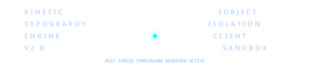
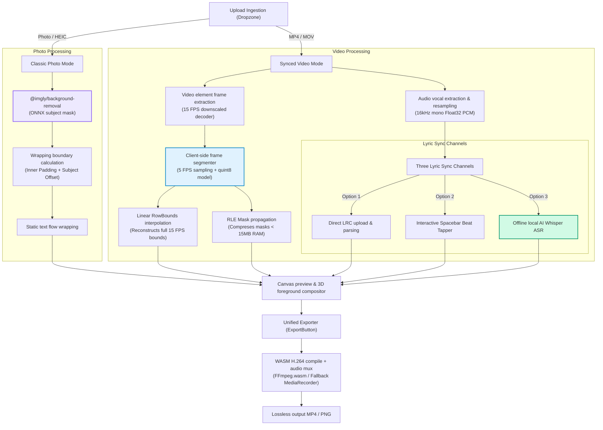

<!-- Header Block -->
<div align="center">
  <br />
  <!-- Glowing Animated Azure Banner (Pure Vector CSS SVG) -->
  

  <p>
    <br />
    
    
    
  </p>
  
  <p>
    Contour v2.0 (Kinetic Azure Expansion) scales our browser-based subject typography engine into a fully animated video typesetting studio. Wrap lyrics tightly around moving subject curves completely offline inside a browser sandbox.
  </p>
</div>

<hr style="border: 0; height: 1px; background-image: linear-gradient(to right, rgba(15, 98, 254, 0), rgba(15, 98, 254, 0.4), rgba(15, 98, 254, 0));" />

<!-- Kinetic Typography Wrapping Simulation (Pure CSS Vector SVG) -->
<div align="center">
  <h3>🌀 Interactive Subject-Contour Wrapping Grid</h3>
  <br />
  
</div>

<br />

---

## ⚡ Key Highlights of the v2.0 Azure Expansion

### 🎭 Concurrency-Safe Video Subject Isolation
* **Parallel-Seeking Extraction**: Spawns 3 parallel offscreen video elements to seek and grab raw frame `ImageData` concurrently in under 2 seconds. Video elements are cleared immediately to free up browser resources.
* **Sequential AI Inference**: Loops through cached frames sequentially to evaluate subject silhouettes. This completely eliminates resource thrashing, memory fragmentation, and silent WebGPU thread locks in the shared ONNX Runtime context, guaranteeing 100% stability.
* **Resilient CPU Fallback**: WebGPU and WebAssembly initialization are wrapped in `Promise.race` timeout races (7s for video, 8s for static photos). If the browser context fails or compiles silently freeze due to driver incompatibilities, the engine falls back to CPU processing seamlessly without interrupting the user.

### 🌀 Alphabetic In-Place Twinkling Matrix Backdrop
* **Pixel-Perfect Exclusion Curves**: Replaces rectangular bounding slabs with dynamic canvas alpha mapping. Text layers are pre-rendered onto a hidden offscreen canvas to obtain a high-fidelity alpha map, sampling characters in a 9-point radial neighborhood to form a tight `8px` contour halo.
* **In-Place Twinkling**: Refactors spatial math to lock characters in their grid coordinates and twinkle independently at high speed, keeping character sets restricted to upper/lowercase `A-Z` for a polished aesthetic.

### 🎤 Timeline & Speech-to-Text Syncing Console
* **Offline AI Transcribing**: Integrates local `Transformers.js` Whisper-Tiny ASR. Resamples uploaded audio tracks to 16kHz mono Float32 PCM inside the browser, and transcribes timestamps completely offline.
* **Tactile Spacebar Beat Tapper**: Paste plain text and tap your spacebar to stamp current millisecond timing offsets dynamically during playback.
* **LRC Timing File Ingestion**: Features an upgraded, BOM-safe parser that handles UTF-8 Byte Order Marks, variable millisecond padded brackets (`[mm:ss.xx]`, `[mm:ss.xxx]`), and supports empty lines to clear out active lyrics during instrumental breaks.

### 💾 Lossless WebAssembly Export
* Compiles your projects directly to MP4 using `ffmpeg.wasm` with custom aspect crops (`1:1`, `4:5`, `9:16`), customizable bitrates, and live estimated output file size indicators. Includes an automatic client-side stream capture fallback.

---

## 📊 Ingestion Pipeline Architecture



---

## 💻 Local Development Setup

```bash
# 1. Install NPM dependencies
npm install

# 2. Launch Vite development server
npm run dev
```
Open **[http://localhost:5173](http://localhost:5173)** in your browser!

---

## 🗂️ Version 1.0 Preservation (Classic Photo Mode)

* **GitHub Branch**: [`v1-classic`](https://github.com/Anuj-9009/contour/tree/v1-classic)
* **GitHub Release Tag**: [`v1.0.0`](https://github.com/Anuj-9009/contour/releases/tag/v1.0.0)

To check out the classic version locally:
```bash
git checkout v1-classic
```

---

## 🛡️ Privacy Sandboxing Guarantee

Contour uses advanced client-side WebAssembly compilers and local machine learning models running in the secure offline browser sandbox. No pictures, videos, or audio tracks are ever uploaded or transmitted to external servers. Your creative assets remain **100% private, secure, and under your control**.

---

<div align="center" style="margin-top: 40px;">
  
</div>
