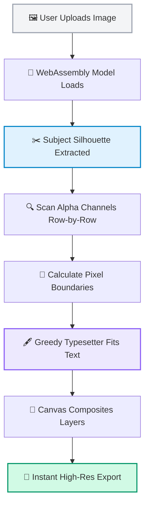

# <p align="center"><br>C O N T O U R</p>

<p align="center">
  <strong>An elegant, browser-based typography engine that wraps text tightly around your photo's subject in real-time.</strong>
</p>

<p align="center">
  
  
  
  <a href="https://contour-jmlq86cmo-anuj-9009s-projects.vercel.app" target="_blank">
    
  </a>
</p>

---

<div align="center">
  <h3>✨ See the Flow. Craft the Canvas. ✨</h3>
  <p>
    Contour brings high-end magazine-cover layouts straight to your web browser. Upload an image, watch our local AI extract your subject, and type text that dynamically flows around the silhouette—entirely inside your browser. No data ever leaves your device.
  </p>
  <br/>
  <a href="https://contour-jmlq86cmo-anuj-9009s-projects.vercel.app" target="_blank" style="text-decoration: none;">
    <strong>🚀 Try the Live Application &rarr;</strong>
  </a>
</div>

<br/>

## 🎯 Features at a Glance

<table align="center" style="width: 100%; border-collapse: collapse; border: none;">
  <tr style="border: none;">
    <td width="50%" style="padding: 15px; border: none; vertical-align: top;">
      <h3>🧠 Local subject extraction</h3>
      <p>Powered by <code>@imgly/background-removal</code> running ONNX models in WebAssembly. Silhouettes are extracted fully client-side in under 3 seconds.</p>
    </td>
    <td width="50%" style="padding: 15px; border: none; vertical-align: top;">
      <h3>🖋️ Custom Greedy Line-Breaker</h3>
      <p>A high-performance paragraph scanner that measures font geometry row-by-row to wrap text tightly and cleanly around subjects.</p>
    </td>
  </tr>
  <tr style="border: none;">
    <td width="50%" style="padding: 15px; border: none; vertical-align: top;">
      <h3>🎨 Carbon Soft Touch Design</h3>
      <p>A premium minimal interface. Built with micro-animations, custom HSL range sliders, dynamic focus rings, and soft glassmorphism.</p>
    </td>
    <td width="50%" style="padding: 15px; border: none; vertical-align: top;">
      <h3>🎭 3D Depth layering</h3>
      <p>Place your subject dynamically <em>in front</em> of your text layer while keeping the original image background intact for a premium 3D composition.</p>
    </td>
  </tr>
</table>

---

## 🚀 Interactive How-It-Works Flowchart

Here's how Contour performs local computer vision and custom typesetting in real-time under the hood:



---

## 💻 Get Started Locally

Get a local copy running in less than a minute!

```bash
# Clone this repository
git clone https://github.com/Anuj-9009/contour.git

# Navigate into the project directory
cd contour

# Install dependencies
npm install

# Launch Vite dev server
npm run dev
```

Open your browser to `http://localhost:5173` and start creating.

---

## 💡 Inspiration & Credits

Contour's line-wrapping and paragraph typesetting engine was inspired by the pioneering work in the [`@chenglou/pretext`](https://github.com/chenglou/pretext) repository. 

Pretext demonstrated that dynamic, browser-native typography wrapping around arbitrary shapes is possible using clean, greedy mathematical layouts rather than relying on heavy graphic editing suites. Contour adapts and extends these core design paradigms for modern React + TypeScript applications.

---

## 🛡️ Privacy Guarantee

Your photos never leave your device. Contour uses state-of-the-art WebAssembly compilers to run advanced AI models completely in the browser sandbox. Because we do not use a backend API, your media remains 100% private, local, and secure.

---

<p align="center">
  Made with 🤍 for designers and developers alike.
</p>
