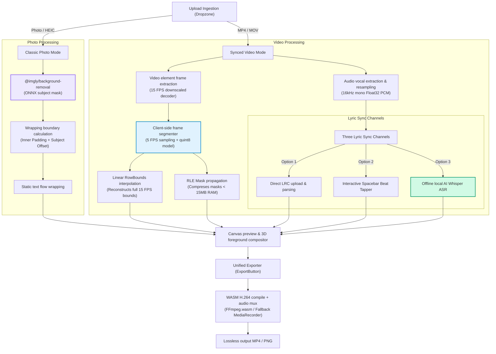

# <p align="center"><br>C O N T O U R &nbsp; v2.0</p>

<p align="center">
  <strong>The Ultimate Client-Side Kinetic Video & Photo Typography Workspace</strong>
</p>

<p align="center">
  
  
  
  <a href="https://github.com/Anuj-9009/contour/tree/v1-classic" target="_blank">
    
  </a>
</p>

---

<div align="center">
  <h3>✨ Kinetic Canvas. 3D Subject Depth. Zero-Server Privacy. ✨</h3>
  <p>
    <strong>Contour v2.0 (Kinetic Azure Expansion)</strong> scales our browser-based subject typography engine into a fully animated video typesetting studio. Transcribe vocals using client-side AI, sync text to background beats with a tapping console, and wrap lyrics tightly around moving subject curves. All rendering, speech-to-text, and video compiling runs <strong>100% locally in your browser sandbox</strong>.
  </p>
  <br/>
</div>

---

## ⚡ Key Highlights of the v2.0 Azure Expansion

### 🎭 Concurrency-Safe Video subject Isolation
* **Parallel-Seeking Extraction**: Spawns 3 parallel offscreen video elements to seek and grab raw frame `ImageData` concurrently in under 2 seconds. Video elements are cleared immediately to free up browser resources.
* **Sequential AI Inference**: Loops through cached frames sequentially to evaluate subject silhouettes. This completely eliminates resource thrashing, memory fragmentation, and silent WebGPU thread locks in the shared ONNX Runtime context, guaranteeing 100% stability.
* **Resilient CPU Fallback**: WebGPU and WebAssembly initialization are wrapped in `Promise.race` timeout races (7s for video, 8s for static photos). If the browser context fails or compiles silently freeze due to driver incompatibilities, the engine falls back to CPU processing seamlessly without interrupting the user.

### 🌀 Alphabetic In-Place Twinkling Matrix Backdrop
* **Pixel-Perfect Exclusion Curves**: Replaces rectangular bounding slabs with dynamic canvas alpha mapping. The text layers are pre-rendered onto a hidden offscreen canvas to obtain a high-fidelity alpha map. Characters are sampled in a 9-point radial neighborhood to form a tight `8px` contour halo that perfectly wraps around individual letter shapes!
* **In-Place Twinkling**: Refactors spatial math to avoid sliding horizontal movement. Every character stays locked in its grid coordinate and twinkles independently at high speed.
* **Alphabet-Only**: Restricted character sets strictly to upper and lowercase letters (`A-Z`, `a-z`) for a highly polished editorial aesthetic.

### 🎤 Timeline & Speech-to-Text syncing Console
* **Offline AI Transcribing**: Integrates local `Transformers.js` Whisper-Tiny ASR. Resamples uploaded audio tracks to 16kHz mono Float32 PCM inside the browser, and transcribes timestamps completely offline.
* **Tactile Spacebar Beat Tapper**: Paste plain text and tap your spacebar to stamp current millisecond timing offsets dynamically during playback.
* **LRC Timing File Ingestion**: Features an upgraded, BOM-safe parser that handles UTF-8 Byte Order Marks, variable millisecond padded brackets (`[mm:ss.xx]`, `[mm:ss.xxx]`), and supports empty lines to clear out active lyrics during instrumental breaks.

### 💾 Lossless WebAssembly Export
* Compiles your projects directly to MP4 using `ffmpeg.wasm` with custom aspect crops (`1:1`, `4:5`, `9:16`), customizable bitrates, and live estimated output file size indicators. Includes an automatic client-side stream capture fallback.

---

## 📊 Dual-Mode Ingestion Pipeline Architecture

Our typesetter combines local WebAssembly machine learning with custom row-fitting greedy typesetting algorithms to keep all processes 100% client-side:



---

## 💻 Local Development Setup

Clone the project and start creating in less than a minute!

```bash
# 1. Clone this repository
git clone https://github.com/Anuj-9009/contour.git

# 2. Navigate into the project folder
cd contour

# 3. Install NPM dependencies
npm install

# 4. Launch Vite development server
npm run dev
```

Open **[http://localhost:5173](http://localhost:5173)** in your browser!

---

## 🗂️ Version 1.0 Preservation (Classic Photo Mode)

We have fully archived the original, plain-photo **Version 1.0** release of Contour to make sure it is completely safe and accessible. You can access or branch from the classic photo edition at any time via:

* **GitHub Branch**: [`v1-classic`](https://github.com/Anuj-9009/contour/tree/v1-classic)
* **GitHub Release Tag**: [`v1.0.0`](https://github.com/Anuj-9009/contour/releases/tag/v1.0.0)

To check out the classic version locally:
```bash
git checkout v1-classic
```

---

## 💡 Credit & Deep Inspiration: Pretext

Contour's custom row-fitting greedy typography wrapped layouts were heavily inspired by the pioneering typesetting logic in the [**`@chenglou/pretext`**](https://github.com/chenglou/pretext) repository.

Pretext proved that browser-native editorial wrapping around complex subject contours is possible by scanning alpha boundaries and using custom, greedy mathematical line-breaking models. Contour builds upon this brilliant layout model, extending it for dynamic timeline synchronizations, 3D compositing overlays, in-place matrix warp grids, and client-side neural network acceleration. We owe a huge debt of gratitude to the original Pretext codebase for paving the way!

---

## 🛡️ Privacy Sandboxing Guarantee

Contour uses advanced client-side WebAssembly compilers and local machine learning models (Whisper-ASR, Isnet-Segmentation) running in the secure offline browser sandbox. No pictures, videos, or audio tracks are ever uploaded or transmitted to external servers. Your creative assets remain **100% private, secure, and under your control**.

---

<p align="center">
  Made with 🤍 for designers and developers alike.
</p>
